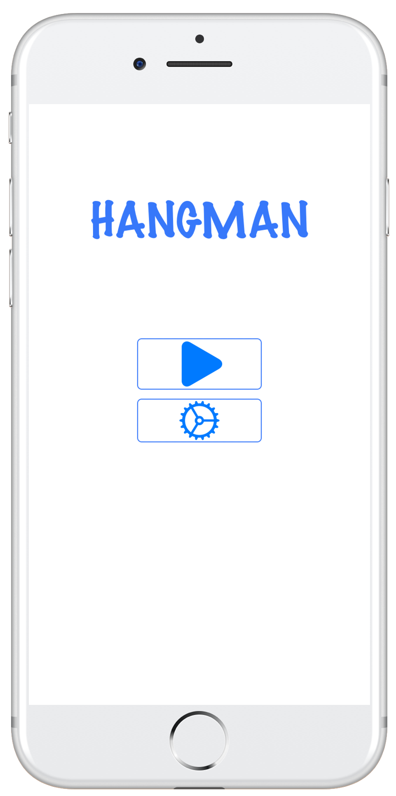
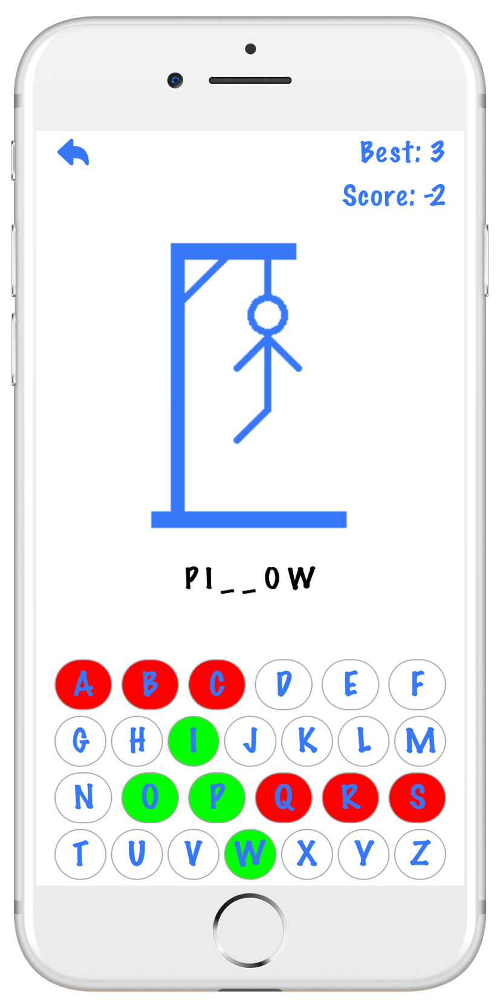
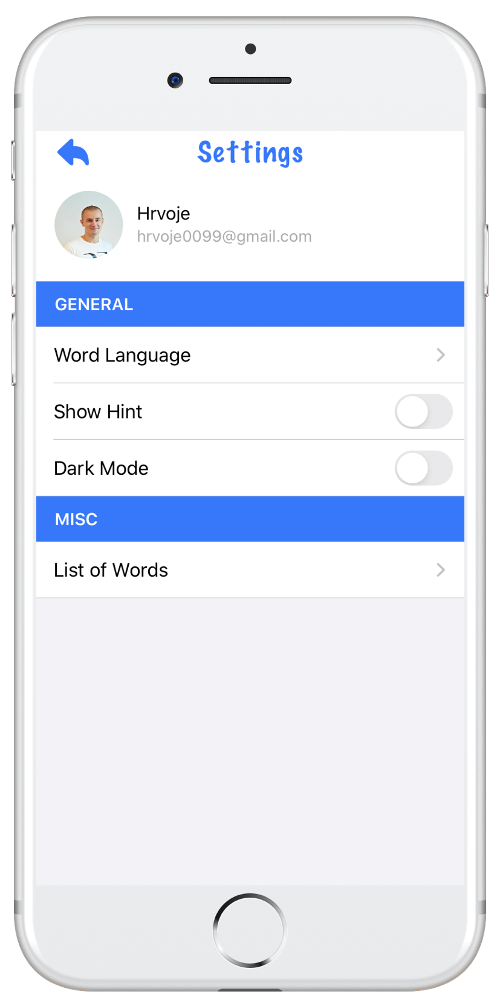
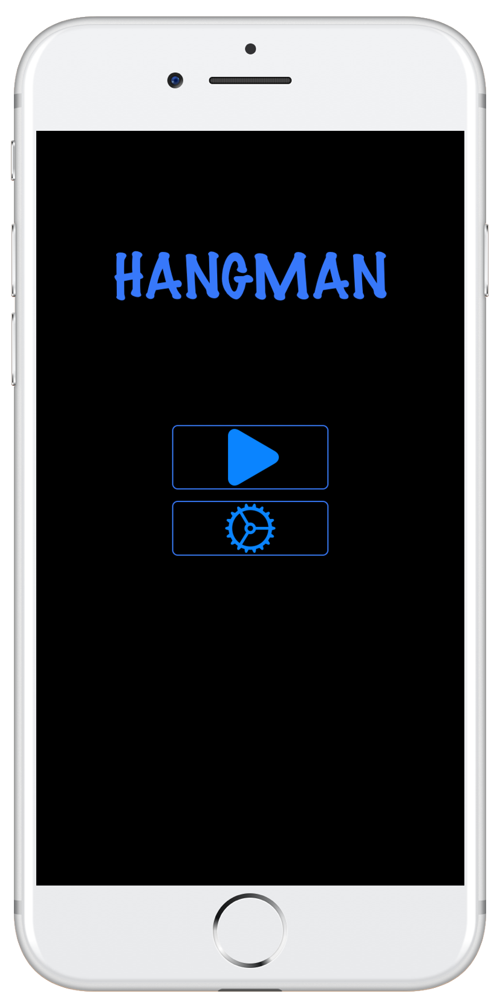
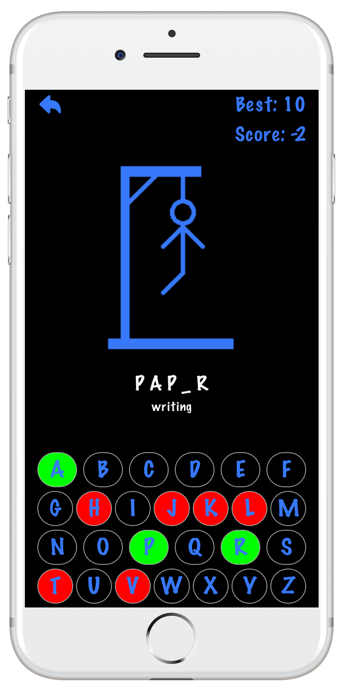
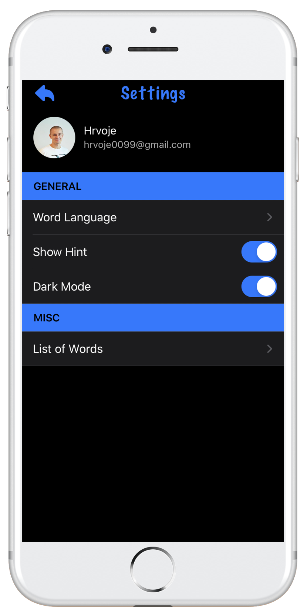

&nbsp;&nbsp;&nbsp;&nbsp;&nbsp;&nbsp;&nbsp;&nbsp;&nbsp;&nbsp;&nbsp;&nbsp;

&nbsp;&nbsp;&nbsp;&nbsp;&nbsp;&nbsp;&nbsp;&nbsp;&nbsp;&nbsp;&nbsp;&nbsp;

# Hangman
Hangman is an iOS word-guessing game, which I recently built as a take-home project. In Hangman a player guessing letter-by-letter to guess the entire word, within a certain number of attempts.

Hangman is written entirely in Swift within the Xcode IDE. The whole application is written without a storyboard ie. user interface elements and their constraints are written programmatically. The application is based on MVVM architecture. I created UserDefaults wrapper using Property Wrapper to make the properties more accessible, easier to maintain and make the code more transparent.

Additional features of the application: localization in English and Croatian, added "Dark mode" settings, reading from JSON.

# Contact Info:

- Email: vukovic.hrvoje@icloud.com
- LinkedIn: [hrvoje-vukovic](https://www.linkedin.com/in/hrvoje-vuković-08117b74)
- Twitter: [@hrvoje0099](https://twitter.com/hrvoje0099)
